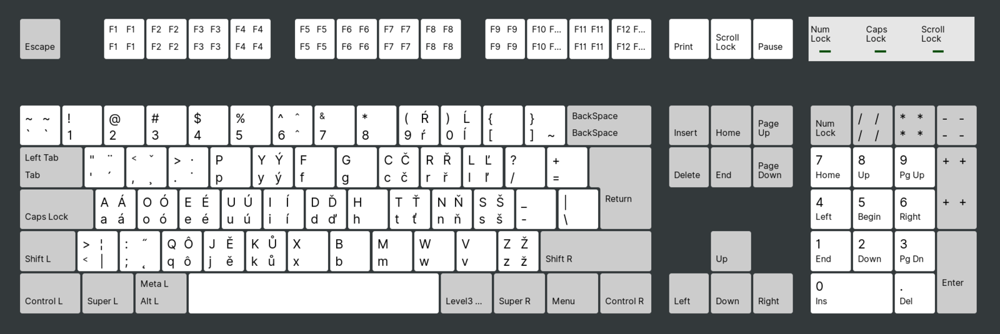

CZ/SK Dvorak Keyboard Layout
============================

Dvorak keyboard keyboard layout with CZ/SK characters.




Installation
------------

Run:

```
make install
```

Then set the keyboard layout:

```
localectl set-x11-keymap cz pc105 dvorak-ucw
```

Old way with setxkbmap should work too:

```
setxkbmap cz dvorak-ucw
```


Credits
-------

The layout file `cz` is taken from Fedora, all credits go to the authors of it.
I just tweaked it a little bit. 


License
-------

MIT
